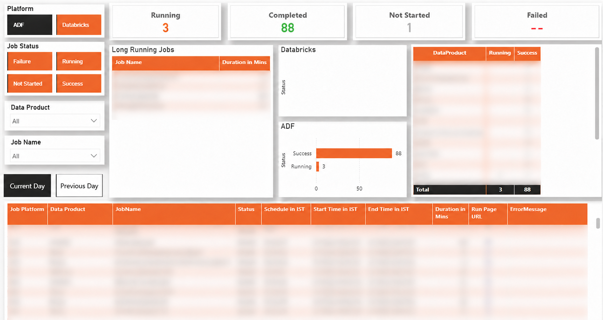
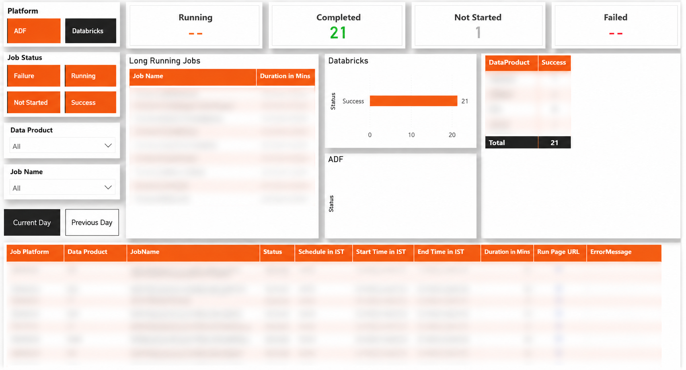
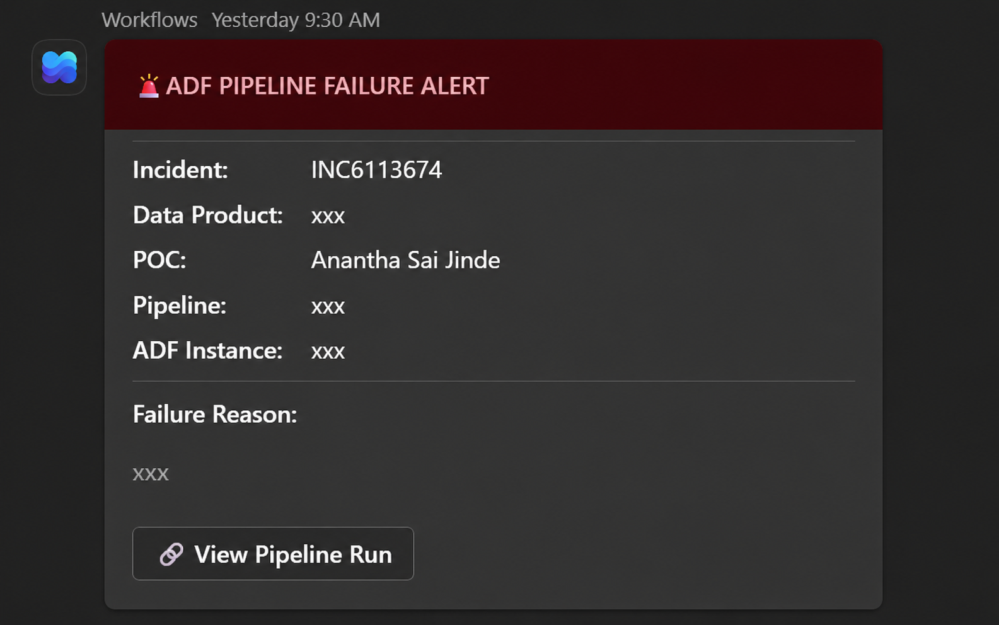
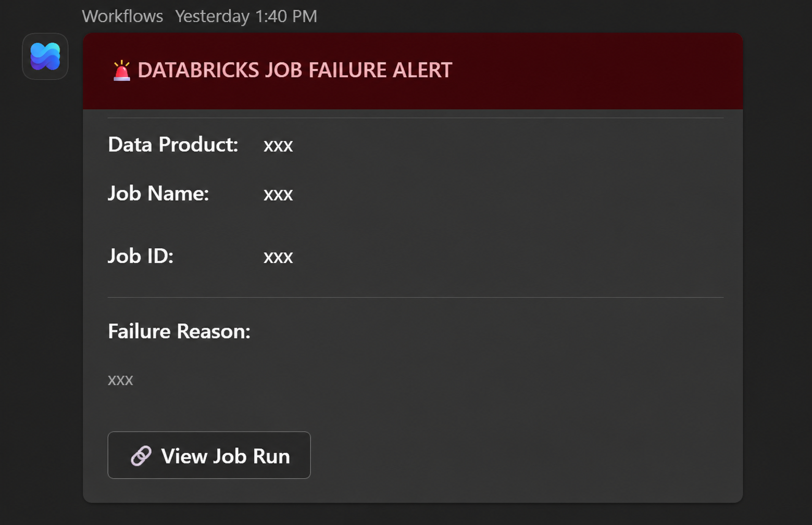

# 🔄 ADF & Databricks Monitoring Automation

**An end-to-end automated monitoring platform for Azure Data Factory pipelines and Databricks jobs, built with Python Azure Functions, SQL Server, Azure Logic Apps, and Power BI.**


---

## 📋 Overview

This system automates the monitoring of **ADF pipelines** and **Databricks jobs** across multiple data products, providing real-time failure detection, automated alerting, and incident management. The architecture is fully config-driven — adding a new pipeline or job requires a single INSERT statement in the master table, making it horizontally scalable to any number of pipelines, jobs, and data products without code changes.

### Scalability & Effort Savings

The automation's impact scales linearly with the number of monitored jobs. Here's an example:

| Scenario | Pipelines & Jobs | Team Size | Manual Effort Replaced |
|----------|-----------------|-----------|----------------------|
| Small team | 50 pipelines, 15 Databricks jobs | 10 engineers | ~8–10 hours/week |
| Medium team | 150 pipelines, 45 Databricks jobs | 25 engineers | ~20–25 hours/week |
| Large team | 500 pipelines, 100 Databricks jobs | 50 engineers | ~60–75 hours/week |

**How the estimate works**: Each pipeline/job requires ~2–3 minutes of manual status checking per day (opening the portal, navigating to the run, checking status, noting failures). With 200 scheduled executions daily, that's ~400–600 minutes (~7–10 hours) of checking alone. Add failure triage (~30 min/day), incident creation (~15 min/day), status reporting (~20 min/day), and re-trigger follow-up (ongoing) — the total effort becomes substantial. This automation reduces all of it to zero manual effort.

### What It Does

| Capability | Description |
|-----------|-------------|
| **Real-Time Monitoring** | Polls ADF and Databricks APIs every 5 minutes to track job status |
| **Failure Alerting** | Sends Adaptive Card alerts to Microsoft Teams within seconds of failure detection |
| **Incident Management** | Automatically creates ServiceNow incidents with smart deduplication (one per pipeline per day) |
| **Self-Healing Dashboard** | Rechecks failed jobs every 15 minutes — auto-corrects status when manual re-triggers succeed |
| **Long-Running Detection** | Tiered threshold algorithm flags jobs exceeding expected duration |
| **Centralized Dashboard** | SQL views powering a Power BI dashboard with real-time status (current + previous day) and failure logs |

---

## 🏗️ Architecture

The system follows an event-driven, serverless architecture deployed entirely on Azure:

```
┌──────────────────┐     REST API      ┌───────────────────────┐     HTTP POST     ┌─────────────────┐
│  Azure Data      │◄─────────────────►│  Azure Functions      │─────────────────►│  Azure Logic App │
│  Factory         │                   │  (Python, Timer)      │                   │  → Teams Alerts  │
│  ADF Pipelines   │                   │                       │                   └─────────────────┘
└──────────────────┘                   │  ┌─────────────────┐  │     REST API     ┌─────────────────┐
                                       │  │ ADF Monitor     │  │─────────────────►│  ServiceNow     │
┌──────────────────┐     REST API      │  │ (every 5 min)   │  │                   │  Auto Incidents  │
│  Databricks      │◄─────────────────►│  ├─────────────────┤  │                   └─────────────────┘
│  Databricks Jobs │                   │  │ DB Monitor      │  │
└──────────────────┘                   │  │ (every 5 min)   │  │     ODBC        ┌─────────────────┐
                                       │  ├─────────────────┤  │─────────────────►│  Azure SQL DB   │
                                       │  │ Recheck Monitor │  │                   │  jobmonitoring   │
                                       │  │ (every 15 min)  │  │                   │  schema          │
                                       │  └─────────────────┘  │                   └────────┬────────┘
                                       └───────────────────────┘                            │
                                                                                    DirectQuery
                                                                                            │
                                                                                   ┌────────▼────────┐
                                                                                   │  Power BI       │
                                                                                   │  Dashboard      │
                                                                                   └─────────────────┘
```

For a detailed architecture breakdown, see [docs/architecture.md](docs/architecture.md).

---

## 📸 Screenshots

### Power BI Dashboard
| ADF Pipeline View | Databricks Job View |
|:-:|:-:|
|  |  |

### Teams Failure Alerts (Adaptive Cards)
| ADF Pipeline Alert | Databricks Job Alert |
|:-:|:-:|
|  |  |

---

## 🛠️ Tech Stack

| Component | Technology |
|-----------|-----------|
| **Compute** | Azure Functions (Python 3.9+, Timer Trigger) |
| **Orchestration Monitoring** | Azure Data Factory Management SDK |
| **Job Monitoring** | Databricks REST API 2.1 |
| **Database** | Azure SQL Server (jobmonitoring schema) |
| **Alerting** | Azure Logic Apps → Microsoft Teams (Adaptive Cards) |
| **Incident Management** | ServiceNow REST API |
| **Dashboard** | Power BI (DirectQuery mode) |
| **Authentication** | Azure AD Service Principal, Active Directory Password |

---

## 📁 Project Structure

```
Job-Monitoring-Automation/
├── README.md
├── requirements.txt
├── .gitignore
│
├── src/                              # Application source code
│   ├── adf_monitor/                  # ADF pipeline monitoring function
│   │   ├── __init__.py
│   │   └── adf_jobs.py
│   ├── databricks_monitor/           # Databricks job monitoring function
│   │   ├── __init__.py
│   │   └── databricks_jobs.py
│   ├── recheck_monitor/              # Failed job recheck function
│   │   ├── __init__.py
│   │   └── recheck_failed_jobs.py
│   └── shared/                       # Shared utilities
│       ├── __init__.py
│       └── db_utils.py               # Centralized DB connection
│
├── sql/                              # Database objects
│   ├── views/                        # SQL views
│   │   ├── vw_adf_job_schedules.sql
│   │   ├── vw_databricks_job_schedules.sql
│   │   ├── vw_rpt_jobs_master.sql
│   │   ├── vw_rpt_jobs_runs.sql
│   │   ├── vw_rpt_jobs_failure_logs.sql
│   │   └── vw_rpt_jobs_status.sql
│   └── stored_procedures/            # Stored procedures
│       ├── usp_update_adf_job_runs.sql
│       └── usp_update_databricks_job_runs.sql
│
└── docs/                             # Documentation
    ├── architecture.md
    ├── project_flow.md
    ├── deployment_guide.md
    └── images/
        ├── architecture_diagram.png
        ├── adf_dashboard.png
        ├── databricks_dashboard.png
        ├── adf_failure_alert.png
        └── databricks_failure_alert.png
```

---

## 📊 Database Schema

### Tables (jobmonitoring schema)

| Table | Purpose |
|-------|---------|
| `ADFJobsMaster` | ADF pipeline registration — name, factory, schedule, incident creation flag |
| `jobsMaster` | Databricks job registration — job ID, workspace, schedule |
| `DataProductConfig` | Product metadata — POC name, assignee ID, CMDB CI for incident routing |
| `jobRuns` | Current day's run records (status, timestamps, run URLs) |
| `JobRunsHistory` | Historical run data for Power BI trending |
| `failureLogs` | Active failure records (auto-deleted when re-trigger succeeds) |
| `incident_log` | ServiceNow incident deduplication (one per pipeline per day) |
| `databricks_alert_log` | Databricks Teams alert deduplication (one per run_id) |
| `jobStatus` | Status dimension table (SUCCESS, FAILURE, RUNNING, NOT STARTED) |

### Views

| View | Purpose |
|------|---------|
| `vw_ADFJobSchedules` | Scheduling logic — which ADF pipelines need polling now (180-min window) |
| `vw_DatabricksJobSchedules` | Scheduling logic — which Databricks jobs need polling now (30-min window) |
| `VwRptJobsMaster` | Dashboard — unified master combining ADF + Databricks |
| `VwRptJobsRuns` | Dashboard — all runs with IST conversion + long-running flags |
| `VwRptJobsFailureLogs` | Dashboard — failure details for trending |
| `VwRptJobsStatus` | Dashboard — status dimension for Power BI filters |

### Stored Procedures

| Procedure | Purpose |
|-----------|---------|
| `UpdateADFJobRuns` | MERGE upsert for ADF runs + failure log insertion |
| `UpdateDatabricksJobRuns` | MERGE upsert for Databricks runs + epoch-to-datetime conversion |

---

## 🔑 Key Features

### 1. Schedule-Aware Monitoring
The system handles complex scheduling scenarios:
- Multiple schedules per job (e.g., `09:00,14:00,22:00`)
- Midnight-crossing schedules (e.g., `23:45` → `00:15`)
- Schedule-specific deduplication (each schedule tracked independently)

### 2. Smart Incident Management
- **One incident per pipeline per day** — prevents ticket flooding
- **Configurable per pipeline** — disable incident creation for known-flaky pipelines while still receiving alerts
- **Dynamic routing** — incidents auto-assigned to the correct POC based on data product ownership
- **Alert always fires** — even when incident creation is disabled, Teams alerts are sent for full visibility

### 3. Self-Healing Dashboard
- Runs every 15 minutes to detect successful manual re-triggers
- Automatically updates status from FAILURE → SUCCESS
- Removes resolved failures from the failure logs
- Dashboard reflects real-time corrected status

### 4. Long-Running Job Detection
Tiered thresholds prevent false alerts:
- **Short jobs (<2h):** flagged at 150% of estimated duration
- **Medium jobs (2-4h):** flagged at 130% of estimated duration
- **Long jobs (>4h):** flagged at 115% of estimated duration

---

## 🚀 Getting Started

See the [Deployment Guide](docs/deployment_guide.md) for detailed setup instructions.

### Quick Start

1. **Clone the repository**
   ```bash
   git clone https://github.com/Ananth-Jinde/ADF-Databricks-Monitoring-Automation.git
   ```

2. **Install dependencies**
   ```bash
   pip install -r requirements.txt
   ```

3. **Configure environment variables** (see [deployment guide](docs/deployment_guide.md))

4. **Deploy SQL objects** — Run the scripts in `sql/views/` and `sql/stored_procedures/`

5. **Deploy Azure Functions** — Deploy the three functions from `src/`

---

## 📖 Documentation

| Document | Description |
|----------|-------------|
| [Architecture](docs/architecture.md) | System architecture and component details |
| [Project Flow](docs/project_flow.md) | Detailed execution flow and data flow |
| [Deployment Guide](docs/deployment_guide.md) | Step-by-step deployment instructions |

---

## 👨‍💻 Author

### Jinde Anantha Sai
Data Engineer 
- 🔗 GitHub: [github.com/Ananth-Jinde](https://github.com/Ananth-Jinde)
- 💼 LinkedIn: [linkedin.com/in/jinde-anantha-sai](https://www.linkedin.com/in/jinde-anantha-sai/)

---

## 📄 License

This project is for portfolio and demonstration purposes.
