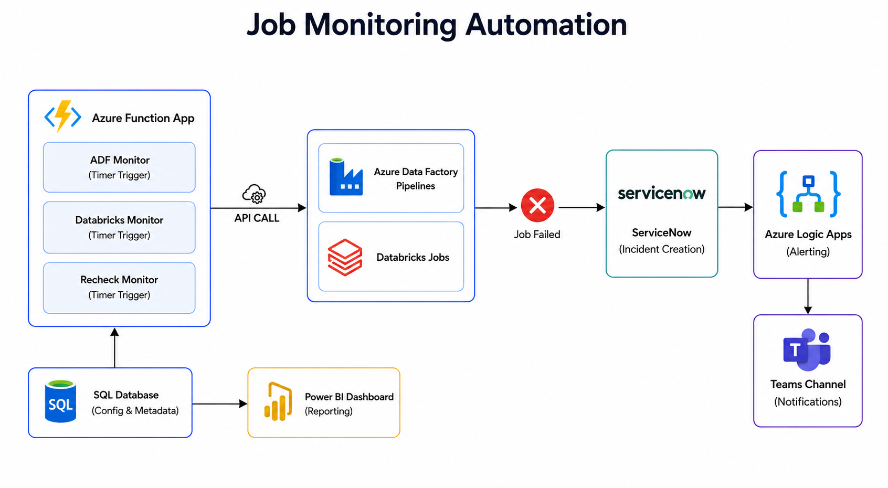

# System Architecture

## High-Level Architecture



The Job Monitoring Automation system follows a **serverless, event-driven architecture** deployed entirely on Microsoft Azure. It consists of five interconnected layers:

---

## 1. Data Pipeline Layer (Monitored Systems)

### Azure Data Factory (ADF)
- ADF pipelines across multiple data factories and subscriptions
- Pipelines orchestrate data movement and transformation
- Many ADF pipelines use Execute Pipeline activities that make REST API calls to Databricks jobs
- Monitored via the **ADF Management SDK** (`azure.mgmt.datafactory`)

### Databricks
- Databricks jobs across multiple workspaces
- Jobs handle compute-heavy data processing and transformations
- Monitored via the **Databricks REST API 2.1** (`/api/2.1/jobs/runs/list` and `/api/2.1/jobs/runs/get`)

---

## 2. Compute Layer (Azure Functions)

Three Python-based Azure Functions run on timer triggers:

### ADF Monitor (`adf_jobs.py`) — Every 5 Minutes
```
Timer Trigger → Query vw_ADFJobSchedules → Call ADF API → Update DB → Alert on Failure
```
- Queries the scheduling view to identify pipelines needing attention
- Calls the ADF Management API to get real-time pipeline status
- Creates ServiceNow incidents on failure (with deduplication)
- Sends Teams alerts via Logic App

### Databricks Monitor (`databricks_jobs.py`) — Every 5 Minutes
```
Timer Trigger → Query vw_DatabricksJobSchedules → Call Databricks API → Update DB → Alert on Failure
```
- Similar flow to ADF Monitor but uses Databricks REST API
- Handles Databricks-specific status mapping (life_cycle_state + result_state)
- Deduplicates alerts using `databricks_alert_log` table

### Recheck Monitor (`recheck_failed_jobs.py`) — Every 15 Minutes
```
Timer Trigger → Query Failed Jobs → Check for Re-triggers → Update Status → Clean Failure Logs
```
- Queries `jobRuns` for entries with Status = FAILURE today
- For each failure, checks if a successful manual re-trigger exists
- Updates status to SUCCESS and removes the failure log entry
- Handles both ADF and Databricks in a single function

---

## 3. Data Layer (Azure SQL Server)

All monitoring data is stored in the `jobmonitoring` schema:

### Core Tables
```
┌─────────────────────┐     ┌─────────────────────┐
│   ADFJobsMaster     │     │   jobsMaster         │
│   (ADF Config)      │     │   (Databricks Config)│
└────────┬────────────┘     └────────┬────────────┘
         │                           │
         ▼                           ▼
┌─────────────────────────────────────────────────┐
│              jobRuns (Current Day)               │
│  Status: SUCCESS | FAILURE | RUNNING | QUEUED    │
└────────┬────────────────────────────┬───────────┘
         │                            │
         ▼                            ▼
┌─────────────────┐      ┌────────────────────────┐
│  failureLogs    │      │  JobRunsHistory        │
│  (Active Fails) │      │  (Archive)             │
└─────────────────┘      └────────────────────────┘
```

### Supporting Tables
- **DataProductConfig**: Maps data products to POC contacts and CMDB CIs
- **incident_log**: Tracks ServiceNow incidents for deduplication
- **databricks_alert_log**: Tracks Teams alerts for deduplication
- **jobStatus**: Status dimension table for Power BI

### Views
- **Scheduling Views**: `vw_ADFJobSchedules`, `vw_DatabricksJobSchedules` — drive the monitoring logic
- **Dashboard Views**: `VwRptJobsMaster`, `VwRptJobsRuns`, `VwRptJobsFailureLogs`, `VwRptJobsStatus` — serve Power BI

### Stored Procedures
- **`UpdateADFJobRuns`**: MERGE upsert for ADF pipeline runs
- **`UpdateDatabricksJobRuns`**: MERGE upsert for Databricks job runs with epoch-to-datetime conversion

---

## 4. Alerting Layer

### Azure Logic Apps
- Receives HTTP POST requests from Azure Functions on job failures
- Renders **Adaptive Cards** in Microsoft Teams with failure details
- Includes direct links to the failed pipeline/job run for quick investigation
- Separate Logic App workflows for ADF and Databricks alerts

### ServiceNow Integration (ADF Only)
- Creates incidents automatically via ServiceNow REST API
- **Smart deduplication**: One incident per pipeline per day
- **Configurable**: Incident creation can be disabled per pipeline
- **Dynamic routing**: Incidents assigned to the correct POC based on data product ownership
- Even when incident creation is disabled, Teams alerts are always sent

---

## 5. Reporting Layer (Power BI)

The Power BI dashboard connects to SQL Server via **DirectQuery** for real-time data:

### Dashboard Features
- **Status KPI Cards**: Running, Completed, Not Started, Failed counts
- **Platform Toggle**: Filter between ADF and Databricks
- **Data Product Filter**: Drill down by data product
- **Long Running Jobs Panel**: Highlights jobs exceeding expected duration
- **Job Detail Table**: Full run details with run page URLs for direct navigation
- **Historical Trends**: Failure and run history

---

## Authentication & Security

| Connection | Auth Method |
|-----------|------------|
| Azure Functions → ADF | Service Principal (Client ID + Secret) |
| Azure Functions → Databricks | Personal Access Token (PAT) |
| Azure Functions → SQL Server | Active Directory Password |
| Azure Functions → Logic App | HTTP endpoint with shared secret |
| Azure Functions → ServiceNow | API Key authentication |
